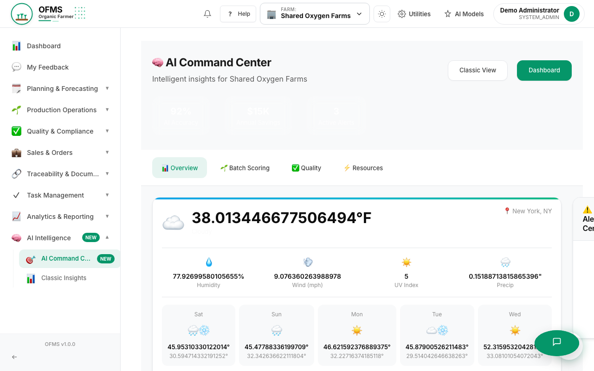
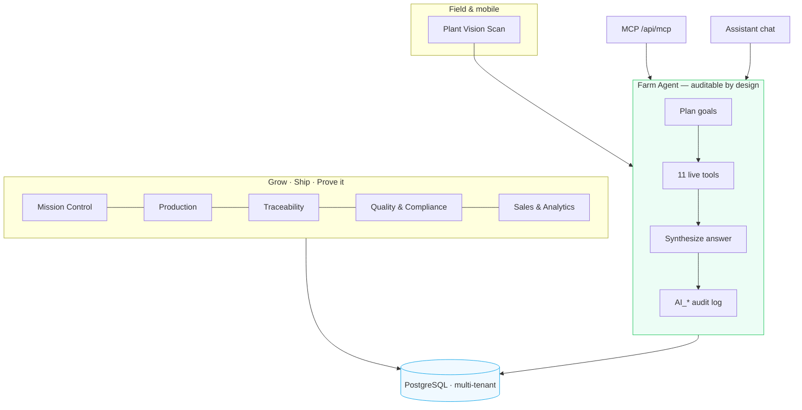
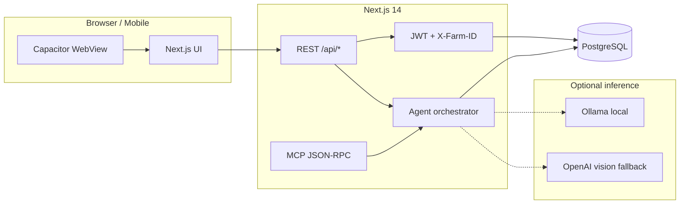

<p align="center">
  <strong>Organic Farm Management System</strong><br/>
  <em>Seed-to-sale ops · audit-ready traceability · agentic intelligence</em>
</p>

<p align="center">
  <a href="LICENSE">MIT</a> ·
  Next.js 14 · TypeScript · PostgreSQL · Capacitor 8 ·
  <a href="docs/SYSTEM_OVERVIEW.md">Docs</a>
</p>

<p align="center">
  
</p>



**OFMS** is one operating picture for regulated farm businesses — production, **traceability**, **compliance** (USDA organic & FDA FSMA workflows), **sales**, and **analytics** on a single **PostgreSQL** model. **OFMS 2.0** adds **Auditable Operations Intelligence**: a native **Farm Agent** that scores batches, forecasts yield, raises alerts, optimizes resources, and **creates tasks** on live data — every tool call logged for diligence. Same platform, **organic microgreens** and **cannabis** demo farms.

| | |
| --- | --- |
| **Product** | Organic Farm Management System (OFMS) |
| **Company** | **Shared Oxygen, LLC** |
| **Scale** | **85** App Router pages · **77** API route handlers · **11** agent tools |
| **Pattern** | Modular monolith — custom TypeScript agent orchestrator (not LangGraph) |

---

## Why it’s different

| Capability | What you get |
| --- | --- |
| **Unified ops** | Batches → harvest → custody → orders in one DB — no spreadsheet reconciliation at audit time |
| **Farm Agent** | Multi-step workflow: goal → tool chain → answer; visible in chat (`Workflow:` line) |
| **Task creation** | Agent `create_task` writes real rows to `tasks` — write-tool classification in `toolClassification.ts` |
| **Observability** | `AI_AGENT_RUN`, `AI_MCP_TOOL_CALL`, plant scans in `audit_logs` — real counts in `/observability` |
| **Mobile** | Capacitor iOS/Android + **Plant Vision Scan** in the field (camera → AI health report → optional lot link) |
| **MCP** | Streamable HTTP JSON-RPC at `POST /api/mcp` for external agent integrations |

**Buyer narrative:** [AGENTIC_AI_DIFFERENTIATOR](docs/features/AGENTIC_AI_DIFFERENTIATOR.md) · [One-pager](docs/features/AGENT_ONE_PAGER.md) · [Demo flow](docs/features/AGENT_DEMO_FLOW.md)

---

## Quick start

```bash
git clone https://github.com/sharedoxygen/organic-farmer-app.git
cd organic-farmer-app
npm install && cp .env.example .env
npx prisma migrate dev
npm run seed:showcase    # Curry Island + Shared Oxygen demo farms
npm run verify:all       # tsc + tests + agent on both farms
npm run dev              # http://localhost:3005
```

**Showcase logins:** `kinkead@curryislandmicrogreens.com` · `jay.cee@sharedoxygen.com` (passwords in your `.env` / seed — never committed)

**5-minute demo:** `⌘K` switch farms → **Mission Control** → **AI Command Center** → Farm Agent *“What should I focus on today?”* → **Traceability → Custody** → **Observability**

---

## Platform map



### Key surfaces

| Surface | Route | Role |
| --- | --- | --- |
| Mission Control | `/mission-control` | Farm-type gauges, pipeline, live agent insight |
| AI Command Center | `/ai-dashboard` | Live scoring, yield, resources (`GET /api/ai/dashboard`) |
| Farm Agent chat | AI widgets / `POST /api/ai/assistant` | Tool chain visible per response |
| Observability Hub | `/observability` | Health, latency, `AI_*` trail |
| Operations Center | `/admin/operations` | Run agent, MCP, verify, and ops from UI |
| Plant Vision Scan | `/mobile/plant-scan` | Camera capture → vision AI → optional `batchId` linkage |
| Traceability | `/traceability/*` | Seed-to-sale, lots, custody, recalls |

**Keyboard:** `⌘K` / `Ctrl+K` — command palette & farm switching

### Agent tools (live)

`get_farm_overview` · `score_batches` · `predict_yield` · `generate_alerts` · `optimize_resources` · `get_demand_forecast` · `get_quality_summary` · `analyze_plant` · `get_plant_scan_history` · `get_weather` · `create_task`

| API | Purpose |
| --- | --- |
| `POST /api/ai/agent` | Full agent run + `toolsUsed` trace |
| `POST /api/ai/assistant` | Chat + conversation memory |
| `GET /api/ai/agent/tools` | MCP-compatible catalog |
| `POST /api/mcp` | `initialize` · `tools/list` · `tools/call` |
| `GET /api/operations` | Operations Center registry |

Agent flow: `classifyGoal()` / LLM planner → `loadFarmContext()` → parallel tools → synthesize → `logInference(AI_AGENT_RUN)`. Code: `src/lib/ai/agent/`.

---

## Mobile

```bash
npm run mobile:configure   # LAN IP → .env → icons → cap sync
npm run mobile:dev         # 0.0.0.0:3005 for devices on Wi‑Fi
npm run mobile:open:ios    # or mobile:open:android
```

Details: [docs/MOBILE.md](docs/MOBILE.md)

---

## Tech stack

| Layer | Technology |
| --- | --- |
| Framework | Next.js 14, React 18, App Router |
| Data | PostgreSQL, Prisma 5, row-level `farm_id` |
| Auth | JWT `ofms_session` + `ensureFarmAccess()` |
| UI | Instrument gauges/meters/pipelines, Recharts, CSS modules |
| Mobile | Capacitor 8, `@capacitor/camera` |
| AI | Native orchestrator; Ollama; OpenAI SDK; statistical ML |
| Testing | Jest, Playwright, MSW |

---

## npm scripts

| Script | Purpose |
| --- | --- |
| `npm run dev` | Dev server (**3005**) |
| `npm run seed:showcase` | Demo farms (preserves users when `OFMS_PRESERVE_USERS=1`) |
| `npm run verify:agent` / `verify:all` | Agent + full verification |
| `npm run security:scan` | Credential leak scan |
| `npm run mobile:*` | Capacitor configure, sync, verify |
| `npm run docs:user-guide` / `docs:screenshots` | User guide & Playwright captures |

---

## Security

Never commit `.env`. Run `npm run security:scan` before release. Showcase passwords via `SHOWCASE_*` and `TEST_*` keys in `.env.example`. History purge: `OFMS_CONFIRM_HISTORY_REWRITE=yes npm run security:purge-history` (destructive — force-push + rotate credentials after).

---

## Documentation

| Doc | Contents |
| --- | --- |
| [SYSTEM_OVERVIEW.md](docs/SYSTEM_OVERVIEW.md) | Executive summary |
| [ARCHITECTURE.md](docs/ARCHITECTURE.md) | Modules, request flow, agent layer |
| [MOBILE.md](docs/MOBILE.md) | Capacitor & Plant Vision |
| [AI_USE_CASES.md](docs/features/AI_USE_CASES.md) | Live vs roadmap |
| [INSTALLATION.md](docs/INSTALLATION.md) | Deploy & environment |

---

## License

[MIT License](LICENSE)

<p align="center">
  <strong>Shared Oxygen, LLC</strong><br/>
  <sub>Traceability · compliance · agentic ops — in one place.</sub>
</p>
