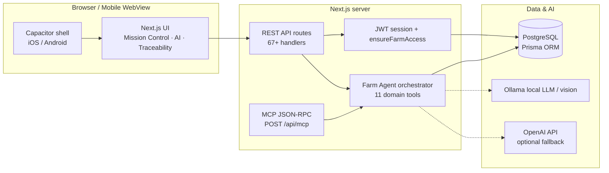

# Organic Farm Management System (OFMS)

[License](LICENSE) · Next.js 14 · TypeScript · PostgreSQL · Capacitor mobile

---

### Strategic fit

**OFMS** is a **unified** operating picture for regulated farm businesses: production, **traceability**, **compliance** (USDA organic–aligned and FDA FSMA–oriented workflows), **sales**, and **analytics** share one **PostgreSQL**-backed model so leadership is not reconciling spreadsheets when an auditor, buyer, or insurer asks for the line of sight from input to shipment. **Per-farm isolation** (multi-tenant) keeps each operation’s data in its own boundary.

**OFMS 2.0** adds **Auditable Operations Intelligence** — a native in-app **Farm Agent** that scores batches, forecasts yield, raises alerts, optimizes resources, and **creates tasks** on live production data, with every tool call logged for due diligence. The same platform serves **USDA organic microgreens** and **cannabis cultivation** demo farms from one tenant model.

### This repository

Implementers get a **unified** Next.js 14 application using the **App Router**, **TypeScript**, **Route Handlers** under `src/app/api/`, and **Prisma** to **PostgreSQL**. The product ships as one **monolith** (one codebase, one deployable). This tree does **not** include GraphQL, Redis, or LangGraph — agent orchestration is a **custom TypeScript orchestrator** in `src/lib/ai/agent/`.

## Branding

| | |
| --- | --- |
| **Product** | Organic Farm Management System (OFMS) |
| **Company** | **Shared Oxygen, LLC** |
| **Positioning** | Operational clarity, audit-ready traceability, and practical analytics for modern growers and multi-site teams. |

---

## At a glance



**Multi-tenancy:** tenant context and farm-scoped queries are enforced via the `X-Farm-ID` header, `TenantProvider`, and `ensureFarmAccess()` on API routes. See [docs/ARCHITECTURE.md](docs/ARCHITECTURE.md).

---

## What ships in the app

### Operations surfaces

| Area | Routes | Notes |
| --- | --- | --- |
| **Mission Control** | `/mission-control` | Farm-type-aware gauges, pipeline, live agent insight |
| **Dashboard** | `/` | Operational KPIs |
| **AI Command Center** | `/ai-dashboard` | Live batch scoring, yield, resources (`/api/ai/dashboard`) |
| **AI Insights** | `/ai-insights` | Forecasting, analysis modals |
| **Observability Hub** | `/observability` | Health, latency, `AI_*` audit trail |
| **Production** | `/production/*` | Batches, seeds, environments, harvest, post-harvest |
| **Planning** | `/planning/*` | Calendar, crops, resources, forecasting |
| **Traceability** | `/traceability/*` | Seed-to-sale, lots, custody, recalls |
| **Quality & compliance** | `/quality/*`, compliance pages | QC, USDA organic, FDA FSMA |
| **Sales & inventory** | `/sales/*`, `/inventory/*` | Orders, stock |
| **Admin** | `/admin/*`, `/settings` | Farms, users, feedback, AI model config |

**Keyboard:** `⌘K` / `Ctrl+K` opens the command palette for navigation and farm switching.

### Agentic AI (Farm Agent)

OFMS uses a **native orchestrator** — not LangGraph or an external agent framework. Flow:

```
User message (chat or API)
  → classifyGoal() / LLM tool planner (Ollama when available)
  → loadFarmContext(farmId) from Prisma
  → execute domain tools (parallel per goal plan)
  → synthesize answer (+ optional Ollama polish)
  → logInference(AI_AGENT_RUN) → audit_logs
  → saveConversationTurn
```

| Layer | Path | Role |
| --- | --- | --- |
| Orchestrator | `src/lib/ai/agent/orchestrator.ts` | Goal classification, multi-tool execution, synthesis |
| Tools | `src/lib/ai/agent/tools.ts` | 11 Prisma-backed domain tools |
| Tool planner | `src/lib/ai/agent/toolPlanner.ts` | Ollama LLM tool selection; falls back to `goalPlans.ts` |
| Farm context | `src/lib/ai/farmContextService.ts` | DB-grounded batches, tasks, orders |
| Inference log | `src/lib/ai/inferenceLogger.ts` | `AI_*` audit trail |
| Conversation | `src/lib/ai/conversationMemory.ts` | Turn persistence via `audit_logs` |

**Agent tools (live):**

`get_farm_overview` · `score_batches` · `predict_yield` · `generate_alerts` · `optimize_resources` · `get_demand_forecast` · `get_quality_summary` · `analyze_plant` · `get_plant_scan_history` · `get_weather` · `create_task`

`create_task` writes real rows to `tasks`; alert acknowledgments persist via `POST /api/ai/alerts`.

**APIs:**

| Endpoint | Purpose |
| --- | --- |
| `POST /api/ai/agent` | Full agent run with `toolsUsed` trace |
| `GET /api/ai/agent/tools` | MCP-compatible tool catalog |
| `POST /api/ai/assistant` | Chat → agent + conversation memory |
| `GET /api/ai/dashboard` | AI Command Center aggregate |
| `POST /api/mcp` | Streamable HTTP MCP (JSON-RPC: `initialize`, `tools/list`, `tools/call`) |

External agents use the same session cookie + `X-Farm-ID` auth as the UI.

**Buyer positioning:** [docs/features/AGENTIC_AI_DIFFERENTIATOR.md](docs/features/AGENTIC_AI_DIFFERENTIATOR.md)

### Mobile (iOS & Android)

OFMS runs on phones and tablets via **Capacitor 8**. The native shell loads the same Next.js app from your server (local LAN IP or production HTTPS).

```bash
npm run mobile:configure   # LAN IP → .env → icons → cap sync
npm run mobile:dev         # server on 0.0.0.0:3005
npm run mobile:open:ios    # or mobile:open:android
npm run mobile:verify      # audit config, assets, TypeScript
```

**Plant Vision Scan** (`/mobile/plant-scan`) — field workers photograph a plant; vision AI returns health gauges, findings, organic treatments, and a care timeline. Optional `batchId` links scan KDEs to traceability lots.

- **API:** `POST /api/ai/plant-scan` with `{ imageDataUrl, cropType, farmZone?, notes?, batchId? }`
- **AI stack:** Ollama vision (Qwen3) → OpenAI GPT-4o → structured fallback

Full setup: [docs/MOBILE.md](docs/MOBILE.md)

### Showcase demo farms

| Farm | Type | Owner login |
| --- | --- | --- |
| **Curry Island Microgreens** | USDA organic microgreens | `kinkead@curryislandmicrogreens.com` |
| **Shared Oxygen Farms** | Cannabis cultivation | `jay.cee@sharedoxygen.com` |

```bash
npm run seed:showcase    # upsert demo data; preserves existing users (OFMS_PRESERVE_USERS=1)
npm run verify:agent     # agent smoke test on both farms
npm run verify:all       # tsc + unit tests + farms + agent + MCP catalog
```

**Prospect demo flow:** sign in → `⌘K` switch farms → Mission Control → AI Command Center → Farm Agent chat (*"What should I focus on today?"*) → Traceability → Observability.

---

## Tech stack

| Layer | Technology |
| --- | --- |
| **Framework** | Next.js 14, React 18, App Router |
| **Language** | TypeScript 5 |
| **Data** | PostgreSQL, Prisma 5, row-level `farm_id` |
| **Auth** | JWT session cookie (`ofms_session`) + `ensureFarmAccess` |
| **UI** | CSS modules, Instrument components (gauges, meters, pipelines), Recharts |
| **Mobile** | Capacitor 8 (`@capacitor/camera`, network, splash, status bar) |
| **Testing** | Jest, Playwright, MSW |
| **AI (optional)** | Custom agent orchestrator; Ollama (local); OpenAI SDK (vision fallback); `ml-regression`, `simple-statistics` for deterministic models |

---

## Quick start

```bash
git clone <repository-url>
cd organic-farmer-app
npm install
cp .env.example .env   # configure DATABASE_URL at minimum
npx prisma migrate dev
npm run db:seed        # or npm run seed:showcase for demo farms
npm run dev            # http://localhost:3005
```

### Prerequisites

- **Node.js** 18+ and **npm** 9+
- **PostgreSQL** 14+
- **Optional:** Ollama for local LLM/vision; `OPENAI_API_KEY` for cloud vision fallback

### Common npm scripts

| Script | Purpose |
| --- | --- |
| `npm run dev` | Development server (port **3005**) |
| `npm run build` / `npm start` | Production build and start |
| `npm run lint` / `npm run type-check` | ESLint / TypeScript |
| `npm test` / `npm run test:e2e` | Jest / Playwright |
| `npm run db:migrate` / `db:seed` / `db:reset` | Prisma workflows |
| `npm run db:health` / `db:integrity:check` | Database checks |
| `npm run seed:showcase` | Curry Island + Shared Oxygen demo data |
| `npm run verify:agent` / `verify:all` | Agent + full stack verification |
| `npm run security:scan` | Scan repo for leaked credentials (read-only) |
| `npm run docs:user-guide` / `docs:screenshots` | User guide generation / Playwright screenshots |
| `npm run mobile:*` | Capacitor configure, sync, open, verify |

### Optional: local Ollama

```bash
# Pull models referenced in .env.example
ollama pull qwen3:latest
ollama pull deepseek-r1:latest
```

Set `OLLAMA_BASE_URL`, `OLLAMA_VISION_MODEL`, and related vars in `.env`. OFMS auto-resolves installed model tags when exact names differ.

---

## AI features (configurable)

| Capability | Implementation | Requires |
| --- | --- | --- |
| **Farm Agent** | Custom orchestrator + 11 tools | Database seeded; Ollama optional for LLM planner/polish |
| **Batch scoring** | `batchScoringAI` | Active batches in DB |
| **Yield / demand forecast** | Statistical + heuristic models | Order/batch history |
| **Alerts** | `alertEngine` + acknowledgment pipeline | Batch + resource context |
| **Plant Vision Scan** | `plantVisionAnalysis` | Ollama vision and/or `OPENAI_API_KEY` |
| **Weather** | `weatherService` | External API key when configured |

> End-to-end behavior depends on **which keys and endpoints are configured**. Run `npm run verify:all` after seeding to validate agent paths. Do not cite fixed accuracy numbers without validating against your environment.

---

## Security

- **Never commit `.env`** — it is gitignored; use `.env.example` as the template.
- **Scan before release:** `npm run security:scan` checks for hardcoded database URLs, API keys, and known demo passwords.
- **Legacy sanitization:** `bash scripts/sanitize-for-open-source.sh` replaces hardcoded credentials in older scripts.
- **Git history cleanup:** `bash scripts/clean-git-history.sh` (destructive — rewrites history; use only when preparing a public release).
- **Showcase passwords:** set `SHOWCASE_CURRY_PASSWORD`, `SHOWCASE_DEMO_PASSWORD`, and `TEST_*_PASSWORD` in `.env` for local demo accounts — never hardcode in source.

If `security:scan` reports findings under `backups/pre-sanitization-*`, remove those paths from git tracking and rotate any exposed credentials.

---

## Production deployment

```bash
npm run build
npm run db:migrate:prod   # against production DATABASE_URL
npm start                 # configure HOST, PORT, NODE_ENV
```

Operational checklist: `npm run db:health`, `npm run db:integrity:check`, `npm run verify:all` (against staging).

For mobile production: deploy Next.js to HTTPS, set `CAPACITOR_SERVER_URL`, run `npm run mobile:sync`, then archive in Xcode or sign APK/AAB in Android Studio.

See [docs/INSTALLATION.md](docs/INSTALLATION.md) and [docs/guides/OPERATIONS.md](docs/guides/OPERATIONS.md).

---

## Repository layout

| Path | Role |
| --- | --- |
| `src/app/` | App Router pages and API route handlers |
| `src/components/` | React UI, Instrument widgets, mobile providers |
| `src/lib/ai/` | Agent orchestrator, inference logging, vision, scoring |
| `src/lib/mobile/` | Capacitor platform detection and init |
| `prisma/` | Schema, migrations, seeds |
| `scripts/` | Verification, mobile config, doc generation, `scan-secrets.mjs` |
| `docs/` | Architecture, mobile, AI use cases, buyer differentiator |
| `ios/`, `android/` | Capacitor native projects |
| `automation/` | Playwright flows and test helpers |

---

## Documentation index

| Document | Contents |
| --- | --- |
| [docs/SYSTEM_OVERVIEW.md](docs/SYSTEM_OVERVIEW.md) | OFMS 2.0 executive summary |
| [docs/ARCHITECTURE.md](docs/ARCHITECTURE.md) | Request flow, modules, agent layer |
| [docs/MOBILE.md](docs/MOBILE.md) | Capacitor setup, Plant Vision Scan |
| [docs/features/AGENTIC_AI_DIFFERENTIATOR.md](docs/features/AGENTIC_AI_DIFFERENTIATOR.md) | Buyer positioning, honest boundaries |
| [docs/features/AI_USE_CASES.md](docs/features/AI_USE_CASES.md) | Live vs roadmap AI scenarios |
| [docs/INSTALLATION.md](docs/INSTALLATION.md) | Install and environment detail |

---

## License

[MIT License](LICENSE) — see the file for full terms.

---

**Shared Oxygen, LLC** — *OFMS: traceability, compliance, agentic operations intelligence, and day-to-day farm management in one place.*
