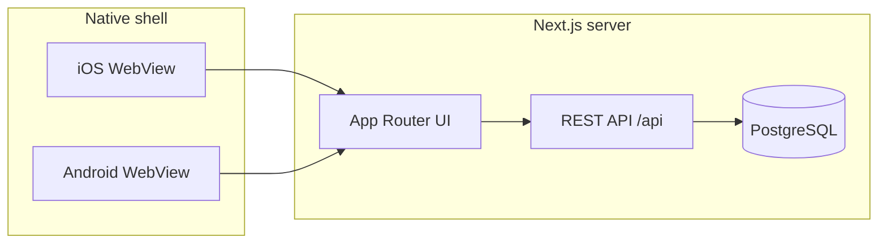

# OFMS Mobile (Capacitor)

OFMS ships as native **iOS** and **Android** apps via [Capacitor](https://capacitorjs.com/). The mobile shell wraps the same Next.js application (UI + API routes) loaded from your deployed or local dev server.

## Architecture



The monolith stays on the server. Capacitor does **not** bundle the Next.js build; it opens a WebView pointed at `CAPACITOR_SERVER_URL`.

## Prerequisites

| Platform | Requirements |
|----------|----------------|
| **Both** | Node 18+, `npm install` |
| **iOS** | macOS, Xcode 15+, CocoaPods (`sudo gem install cocoapods`) |
| **Android** | Android Studio, JDK 17+, Android SDK |

## Quick start (development)

**One command** detects your LAN IP, updates `.env`, generates branded icons/splash screens, and syncs native projects:

```bash
npm run mobile:configure
```

Then start the server and open a native IDE:

```bash
npm run mobile:dev              # binds 0.0.0.0:3005 for phones on Wi‑Fi
npm run mobile:open:ios         # Xcode
npm run mobile:open:android     # Android Studio
```

Physical devices cannot use `localhost` — `mobile:configure` sets `CAPACITOR_SERVER_URL` to your Mac's LAN IP automatically (e.g. `http://192.168.1.37:3005`).

## npm scripts

| Script | Purpose |
|--------|---------|
| `npm run mobile:configure` | LAN IP → `.env` → branded assets → `cap sync` |
| `npm run mobile:verify` | Audit `.env`, native configs, assets, and TypeScript |
| `npm run mobile:assets` | Regenerate OFMS icons and splash screens |
| `npm run mobile:sync` | Copy web assets and update native projects |
| `npm run mobile:copy` | Copy web assets only |
| `npm run mobile:open:ios` | Open Xcode |
| `npm run mobile:open:android` | Open Android Studio |
| `npm run mobile:run:ios` | Build and run on iOS (CLI) |
| `npm run mobile:run:android` | Build and run on Android (CLI) |
| `npm run mobile:build:android` | Assemble debug APK (CI / verification) |
| `npm run mobile:dev` | Dev server on `0.0.0.0:3005` |
| `npm run mobile:start` | Production server on `0.0.0.0:3005` |

## Production builds

1. Deploy the Next.js app to your hosting environment (HTTPS required for App Store / Play Store).
2. Set `CAPACITOR_SERVER_URL` to the production URL, e.g. `https://ofms.example.com`.
3. Run `npm run mobile:sync`.
4. Archive in Xcode (iOS) or generate a signed APK/AAB in Android Studio.

App ID: `com.sharedoxygen.ofms`  
Display name: **OFMS**

## Native features enabled

- Splash screen and status bar styling (brand green `#22C55E`)
- Android hardware back button → browser history
- Network connectivity banner when offline
- Safe-area insets for notched devices
- iOS input zoom prevention (16px minimum font size)
- **Plant Vision Scan** — camera capture + AI image analysis (`/mobile/plant-scan`)

### Plant Vision Scan

Field workers can photograph a plant and receive a rich AI health report:

1. Open **AI Intelligence → Plant Vision Scan** (or navigate to `/mobile/plant-scan`)
2. Tap to capture via native camera (or pick from gallery / file on web)
3. Select crop type and optional notes
4. **Analyze with AI** — vision model examines disease, pests, nutrients, and stress

The report includes radial health gauges, indicator meters, canopy assessment bars, findings cards, organic treatment recommendations, and a care timeline.

**API:** `POST /api/ai/plant-scan` with `{ imageDataUrl, cropType, farmZone?, notes? }`

**AI stack:** Ollama vision (Qwen3) → OpenAI GPT-4o → intelligent fallback

## Troubleshooting

| Issue | Fix |
|-------|-----|
| Blank white screen on device | `CAPACITOR_SERVER_URL` must be reachable from the device; check firewall and same Wi‑Fi network |
| SSL / cleartext errors on Android | Dev HTTP is allowed via `network_security_config.xml`; use HTTPS in production |
| iOS ATS blocks HTTP | Local networking exception is configured for development |
| Changes not appearing | Run `npm run mobile:sync` after config changes |
| Native app loads `localhost` on device | `capacitor.config.ts` reads `.env` automatically; run `npm run mobile:verify` to confirm |
| Gradle `UseSVE=0` or wrong Java | Use `npm run mobile:configure` or `mobile:build:android` — scripts route through Android Studio JBR |

## Project layout

```
capacitor.config.ts    # App ID, server URL, plugin config
www/                   # Fallback shell when server is unreachable
ios/                   # Xcode project (generated)
android/               # Android Studio project (generated)
src/lib/mobile/        # Platform detection and Capacitor init
src/components/mobile/ # CapacitorProvider (offline banner, lifecycle)
```
