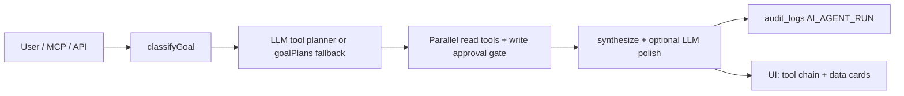

# OFMS Agent Architecture — Buyer Diligence Brief

**Product:** Auditable Operations Intelligence  
**Pattern:** Multi-step agent workflow (goal → plan → tools → synthesize → audit)

**Sales assets:** [AGENT_ONE_PAGER.md](./AGENT_ONE_PAGER.md) · [AGENT_DEMO_FLOW.md](./AGENT_DEMO_FLOW.md)

---

## Workflow (equivalent to graph-based agent frameworks)

| Framework concept | OFMS implementation |
|-------------------|----------------------|
| Workflow / graph | `orchestrator.ts` + `goalPlans.ts` + `toolPlanner.ts` |
| Nodes | 11 domain tools in `tools.ts` (Prisma-backed) |
| State | `AgentContext`, `farmContext`, conversation history |
| Checkpointing / audit | `audit_logs` (`AI_AGENT_RUN`, `AI_CONVERSATION_TURN`) |
| Tool catalog | MCP `tools/list`, `GET /api/ai/agent/tools` |
| Human-in-the-loop writes | `create_task` requires `confirmWrites: true` |
| External agents | `POST /api/mcp` (JSON-RPC) |

---

## Proof points (live demo)

1. Farm Agent chat — visible workflow: `get_farm_overview → score_batches → generate_alerts → …`
2. Task creation — propose → **Confirm** button → row in `tasks` table
3. Observability Hub — `AI_*` events after each run
4. CLI verification — `npm run verify:agent` (Curry Island + Shared Oxygen)

---

## Write safety

| Tool | Default behavior | To persist |
|------|------------------|------------|
| `create_task` | Returns proposal (`pendingWrites`) | `confirmWrites: true` on API, or Confirm in chat |
| MCP `create_task` | Proposal only | Pass `_confirmWrite: true` in arguments |

All other tools are read-only against farm data.

---

## APIs

| Endpoint | Purpose |
|----------|---------|
| `POST /api/ai/agent` | Full workflow run + `toolsUsed` trace |
| `POST /api/ai/assistant` | Chat + conversation memory + write approval |
| `POST /api/mcp` | External agent integration |
| `GET /api/ai/dashboard` | AI Command Center aggregates |

---

## Honest boundaries

- Not LangGraph — native TypeScript workflow engine tuned for farm tenancy and audit
- On-demand invocation — not 24/7 autonomous operation
- Ollama optional — deterministic `goalPlans` when LLM unavailable

---

*Source of truth: `src/lib/ai/agent/`. Last updated: June 2026.*
